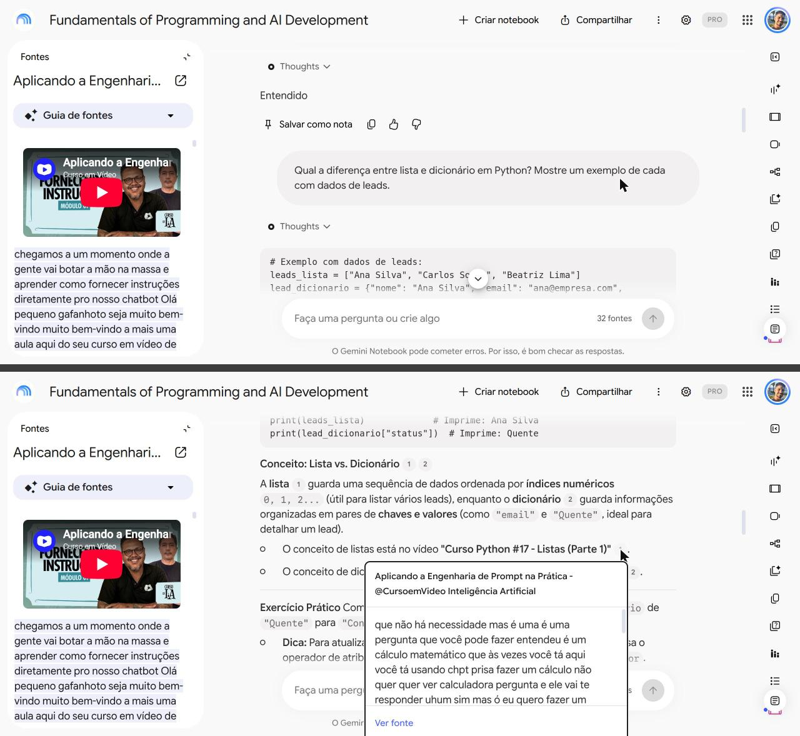
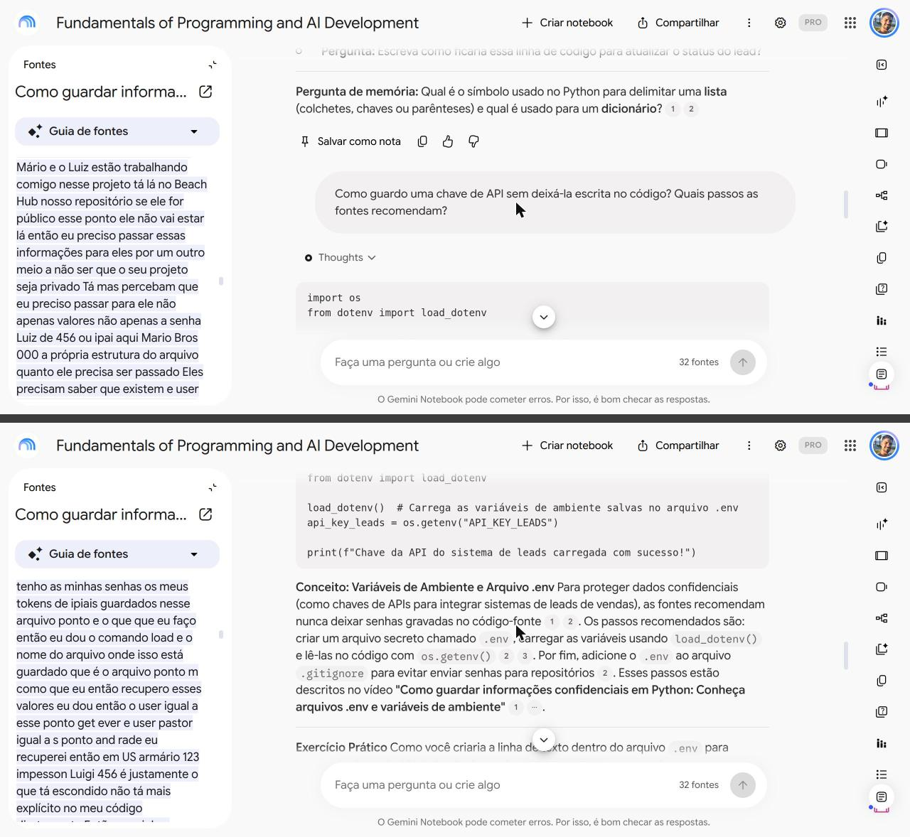
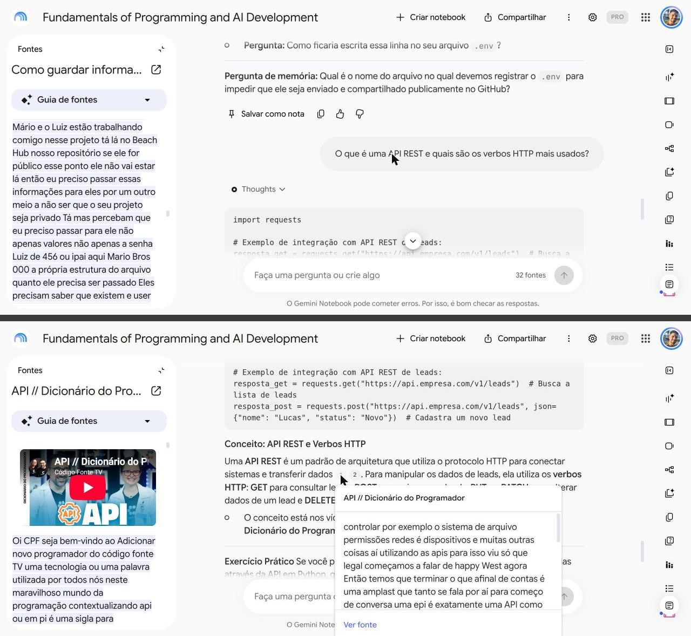

# Segundo cérebro: Python e APIs de IA para iniciantes

> Projeto do desafio da DIO: um notebook no Gemini Notebook (NotebookLM) que responde só pelas fontes que eu escolhi.

## Tema e objetivo

**Tema:** Python e APIs de IA para iniciantes: a primeira etapa da minha trilha para Forward Deployed Engineer (FDE)

**Objetivo, em uma frase:** Ter um tutor que me ensine, só com as aulas que eu escolhi, o Python e o uso de APIs de IA de que preciso para escrever meu primeiro script que classifica leads com IA.

## Fontes que entraram e por que confio nelas

São 32 fontes: 31 videoaulas e 1 página de documentação oficial. Critérios que usei: aula em português para iniciante, prática e direta ao tema; sem tutoriais de instalação; prioridade para o Curso em Vídeo (Gustavo Guanabara); documentação oficial quando existe. Usei o Claude para levantar os candidatos a partir do meu plano de estudos e eu decidi o que ficou.

| Canal | Fontes | Por que confio |
|---|---|---|
| Curso em Vídeo | [O que é Git? O que é versionamento? - Curso de Git e GitHub](https://www.youtube.com/watch?v=xEKo29OWILE)<br>[Criando o primeiro Repositório - Curso de Git e GitHub](https://www.youtube.com/watch?v=5BYm7UdCrX0)<br>[Usando IA para estudar e aprender - Curso em Vídeo IA](https://www.youtube.com/watch?v=RaSxjr6F_eI)<br>[Terminal no Linux - Introdução - Curso Linux #07.1](https://www.youtube.com/watch?v=mgs92GtkQCE)<br>[Curso Python #06 - Tipos Primitivos e Saída de Dados](https://www.youtube.com/watch?v=hdDHg1p3YVc)<br>[Curso Python #04 - Primeiros comandos em Python3](https://www.youtube.com/watch?v=31llNGKWDdo)<br>[Curso Python #07 - Operadores Aritméticos](https://www.youtube.com/watch?v=Vw6gLypRKmY)<br>[Curso Python #10 - Condições (Parte 1)](https://www.youtube.com/watch?v=K10u3XIf1-Q)<br>[Curso Python #012 - Condições Aninhadas](https://www.youtube.com/watch?v=j9bYDjaAYzw)<br>[Curso Python #17 - Listas (Parte 1)](https://www.youtube.com/watch?v=N1hTsbW50eM)<br>[Curso Python #013 - Estrutura de repetição for](https://www.youtube.com/watch?v=cL4YDtFnCt4)<br>[Curso Python #014 - Estrutura de repetição while](https://www.youtube.com/watch?v=LH6OIn2lBaI)<br>[Curso Python #19 - Dicionários](https://www.youtube.com/watch?v=ZWj8o692qGY)<br>[Curso Python #20 - Funções (Parte 1)](https://www.youtube.com/watch?v=ezfr9d7wd_k)<br>[Curso Python #23 - Tratamento de Erros e Exceções](https://www.youtube.com/watch?v=xz2B3bfNjEk)<br>[Design de Prompt: Introdução a Engenharia de Prompt - @CursoemVideo Inteligência Artificial](https://www.youtube.com/watch?v=ATp4Q4UD-c8)<br>[Aplicando a Engenharia de Prompt na Prática - @CursoemVideo Inteligência Artificial](https://www.youtube.com/watch?v=_3lq1Mg4lYw) | Já conheço as aulas do Gustavo Guanabara e considero o conteúdo muito bom; por isso foi a primeira escolha em todo tema que ele cobre. |
| Yuri Lacerda | [Utilizando o Terminal Linux para Executar Programas em Python](https://www.youtube.com/watch?v=-cLfzqbt884) | Aula introdutória sobre usar o terminal do Linux (Ubuntu) para navegar em pastas e rodar scripts em Python. É o mesmo tipo de sistema em que eu estudo. |
| Sharpax | [Operadores RELACIONAIS E LÓGICOS - Curso de Python - Aula 04](https://www.youtube.com/watch?v=MoNDLQJKmQE) | Aula de um curso de Python sobre operadores relacionais e lógicos, usados para comparar dados e tomar decisões. Complementa as aulas do Curso em Vídeo sobre operadores aritméticos e condições. |
| Otávio Miranda | [Encontrando valores em listas com dicionários em Python](https://www.youtube.com/watch?v=r1GpoUKvLcI)<br>[Requests em Python - Consumindo uma API Rest usando o módulo Requests](https://www.youtube.com/watch?v=Qd8JT0bnJGs) | Duas aulas práticas: uma mostra como localizar dados em uma lista de dicionários, situação comum ao consumir APIs; a outra demonstra como consumir uma API REST com o módulo requests. A segunda é a transcrição de uma transmissão ao vivo, então é mais longa. |
| Programação Dinâmica | [Como Ler e Escrever ARQUIVOS em PYTHON \| Python para Iniciantes #13](https://www.youtube.com/watch?v=5OC1tO5iGIA) | Aula 13 de uma série de Python para iniciantes; ensina a manipular arquivos de texto com a função open. Usa como exemplo um projeto de criptografia da própria série. |
| Bóson Treinamentos | [Arquivos CSV no Python - Leitura com biblioteca csv](https://www.youtube.com/watch?v=M46lC42Edn0)<br>[Variáveis de Ambiente no Linux e comandos echo, env e export](https://www.youtube.com/watch?v=UOzTXvm8698) | Duas aulas diretas: leitura de arquivos CSV com a biblioteca csv do Python, e variáveis de ambiente no Linux com os comandos echo, env e export. |
| CFBCursos | [JSON em PYTHON - Curso de Python #36](https://www.youtube.com/watch?v=Ga2p5hbNtyk) | Aula introdutória de um curso de Python sobre manipular dados em JSON com a biblioteca padrão. |
| Jussimar Nascimento Leal | [Git - 2. Comandos Init, Add, Commit e Push no Git](https://www.youtube.com/watch?v=47GyldsyhfE) | Videoaula prática do fluxo inicial do Git por linha de comando (init, add, commit e push), partindo de uma pasta local. Entrou para complementar o curso de Git do Curso em Vídeo com os comandos no terminal. Usa o Git Bash; os comandos do Git são os mesmos no Linux. |
| Código Fonte TV | [API // Dicionário do Programador](https://www.youtube.com/watch?v=vGuqKIRWosk) | Explica o que é uma API. Na pergunta 3, o notebook citou esta fonte e a citação abriu o trecho correspondente (print 3). |
| Ayrton Teshima - Programador a Bordo | [API RESTful #1: Entenda! (Ilustrado!)](https://www.youtube.com/watch?v=Abo_GiaunlU) | Explica API REST e os verbos HTTP de forma ilustrada. Foi citada na resposta da pergunta 3. |
| Dev aos 40 | [Como guardar informações confidenciais em Python: Conheça arquivos .env e variáveis de ambiente](https://www.youtube.com/watch?v=orBR5mFYUFE) | Mostra como guardar chaves e senhas em um arquivo .env e ler com variáveis de ambiente. Na pergunta 2, a citação abriu o trecho do vídeo que descreve os passos (print 2). |
| Programando com Renan | [Como Criar e Gerenciar um Ambiente Virtual (venv) no Python [ATUALIZADO 2025]](https://www.youtube.com/watch?v=TLQBykTLzAE) | Explica o que é um ambiente virtual em Python e como criar e gerenciar um com venv, em versão atualizada em 2025. |
| Nexustech | [How to Set Up the Claude API in Python (First Request Guide) [2026 GUIDE]](https://www.youtube.com/watch?v=S0BsHnBfahw) | Único vídeo em inglês. Mostra a primeira chamada à API do Claude em Python: instalação da biblioteca oficial e configuração segura da chave. Não achei aula equivalente em português; por isso também adicionei a documentação oficial da Anthropic. |
| Anthropic (documentação oficial) | [Quickstart da API do Claude](https://platform.claude.com/docs/en/get-started) | É a documentação oficial de quem faz a API. |

O conteúdo de cada vídeo descrito acima foi conferido no guia de fontes que o próprio notebook gera a partir da transcrição.

## Diretriz de comportamento

Enviei esta diretriz como primeira mensagem do chat:

```
Comporte-se como um tutor de Python para iniciante absoluto. Aprendo melhor com prática antes da teoria.
Responda sempre em português.
Comece toda explicação por um exemplo de código curto que eu possa rodar; só depois diga o nome do conceito.
Explique em no máximo 5 linhas, um conceito por vez, com exemplos de leads de vendas.
Nunca me entregue o código pronto de um exercício: dê uma dica e me faça uma pergunta.
Termine com 1 pergunta para eu responder de memória.
Use apenas o que está nas fontes e diga em qual vídeo está.
Se entendeu, responda só "Entendido".
```

## Perguntas que fiz, respostas e fontes

Cada print junta duas capturas da mesma conversa: em cima a pergunta, embaixo a resposta com a citação aberta.

### Pergunta 1

- **Pergunta:** Qual a diferença entre lista e dicionário em Python? Mostre um exemplo de cada com dados de leads.
- **Resposta (resumo):** a lista guarda uma sequência ordenada por índices numéricos (0, 1, 2...), útil para listar vários leads; o dicionário guarda pares de chave e valor, ideal para detalhar um lead. O notebook começou por um exemplo de código e terminou com um exercício e uma pergunta de memória.
- **Fontes citadas:** o texto da resposta aponta os vídeos "Curso Python #17 - Listas (Parte 1)" e "Curso Python #19 - Dicionários". Ao clicar nas citações 1 e 2, porém, a fonte que abriu foi "Aplicando a Engenharia de Prompt na Prática - @CursoemVideo Inteligência Artificial", com um trecho que não fala de listas. Registro isso como um limite que encontrei ao conferir as citações.



### Pergunta 2

- **Pergunta:** Como guardo uma chave de API sem deixá-la escrita no código? Quais passos as fontes recomendam?
- **Resposta (resumo):** criar um arquivo `.env`, carregar as variáveis com `load_dotenv()`, ler no código com `os.getenv()` e adicionar o `.env` ao `.gitignore` para não enviar senhas ao repositório.
- **Fontes citadas:** "Como guardar informações confidenciais em Python: Conheça arquivos .env e variáveis de ambiente" (Dev aos 40). A citação abriu o trecho do vídeo que descreve esses passos.



### Pergunta 3

- **Pergunta:** O que é uma API REST e quais são os verbos HTTP mais usados?
- **Resposta (resumo):** uma API REST é um padrão de arquitetura que usa o protocolo HTTP para conectar sistemas e transferir dados. Os verbos são GET para consultar, POST para criar, PUT ou PATCH para alterar e DELETE para apagar.
- **Fontes citadas:** "API // Dicionário do Programador" (Código Fonte TV) e "API RESTful #1: Entenda! (Ilustrado!)" (Ayrton Teshima - Programador a Bordo).



## Materiais gerados no Estúdio

- Mapa mental: [materiais/mapa-mental.png](materiais/mapa-mental.png)
- Slides: [materiais/slides.pdf](materiais/slides.pdf)
- Cartões didáticos: [materiais/cartoes.csv](materiais/cartoes.csv)

## Anotações de planejamento

O objetivo e a lista de fontes que escrevi antes de montar o notebook estão em [bloco-de-notas.md](bloco-de-notas.md).

## Link do notebook

https://notebook.google.com/notebook/b0d34770-8fe4-4786-b43d-6896520dee50

## O que aprendi

- Conferir as citações faz diferença. Nas perguntas 2 e 3 a citação abriu o trecho certo; na pergunta 1 o texto nomeava dois vídeos e a citação abria um terceiro.
- O critério de fonte muda o resultado. Tirei os tutoriais de instalação e fiquei só com aulas práticas e em português sobre cada tema.
- Próximo passo: refazer a pergunta 1 com só as duas fontes do tema marcadas e usar o notebook por semana de estudo, marcando apenas as fontes daquela semana.

## Como este projeto foi feito

Usei o Claude (Anthropic) para levantar as fontes candidatas a partir do meu plano de estudos, tirar os prints do chat e redigir este README. Os critérios e a decisão do que entra no notebook foram meus.
